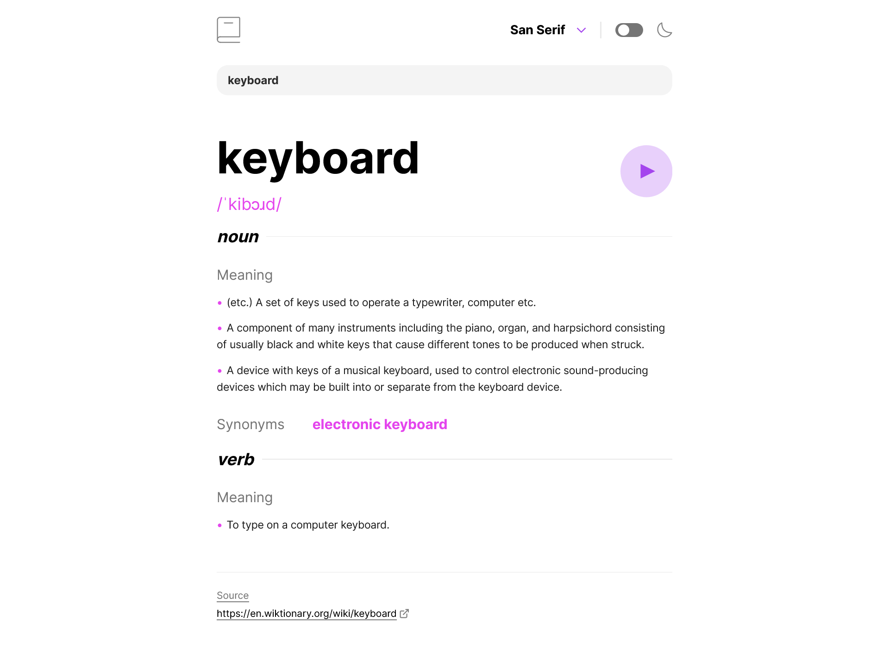
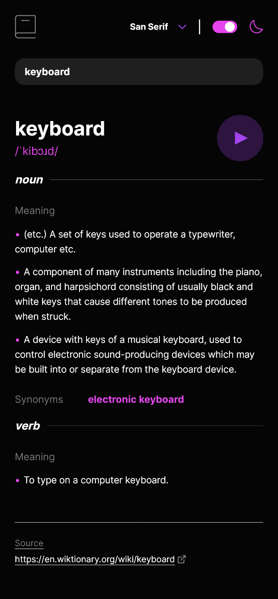

# Frontend Mentor - Dictionary web app solution

This is a solution to the [Dictionary web app challenge on Frontend Mentor](https://www.frontendmentor.io/challenges/dictionary-web-app-h5wwnyuKFL). Frontend Mentor challenges help you improve your coding skills by building realistic projects.

## Table of contents

- [The challenge](#the-challenge)
- [Screenshot](#screenshot)
- [Links](#links)
- [Built with](#built-with)
- [Author](#author)

### The challenge

Users should be able to:

- Search for words using the input field
- See the Free Dictionary API's response for the searched word
- See a form validation message when trying to submit a blank form
- Play the audio file for a word when it's available
- Switch between serif, sans serif, and monospace fonts
- Switch between light and dark themes
- View the optimal layout for the interface depending on their device's screen size
- See hover and focus states for all interactive elements on the page
- **Bonus**: Have the correct color scheme chosen for them based on their computer preferences. _Hint_: Research `prefers-color-scheme` in CSS.

### Screenshot

### Links

- Solution URL: [Github](https://github.com/sonny-coding/dictionary-web-app)
- Live Site URL: [Vercel](https://dictionary-web-app-smoky.vercel.app/)

### Built with

- Flexbox
- CSS Grid
- Mobile-first workflow
- Tailwind
- [React](https://reactjs.org/) - JS library

### What I learned

- Implementing localStorage and hooks

## Author

- Github - [sonny-coding](https://github.com/sonny-coding)
- Twitter - [@sonnyConnect](https://twitter.com/sonnyConnect)
